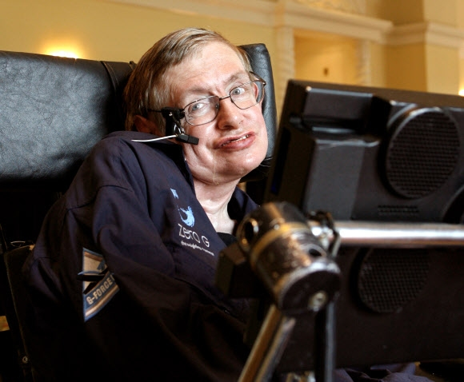

# 메보 10월 발표 정리

## 뇌신경질환

### 개요

* 근위축성측색경화증
* 파킨슨병

---

### 근위축성 측색 경화증 (=루게릭병)

##### 루게릭병이란?

* 운동뉴런의 퇴화로 인하여 골격근에 마비가 발생하는 치명적인 질병이다.
* 발병 후 3~5년 이내에 호흡근 약화로 사망하지만 간혹 스티븐 호킹처럼 10년 이상 생존하는 환자들도 보고되고 있다.

---

##### 원인

* 명확한 원인은 밝혀지지 않았으나 유전적 영향 이 있다.
  - superoxide dismutase 효소의 93번째 아미노산이 Glutmate에서 Alanine으로 변형되는케이스 있음.
* 유전성이 아닌 산발성 루게릭 병에서는 흥부세포독성(excitotoxicity)에 의한 세포자멸사 가 작용되는 것으로 알려짐

##### 증상

* 위운동신경세포 파괴 $\rightarrow$ 겉질숨뇌로, 겉질척수로 손상
* 이에 따라 얼굴, 몸통,사지에 위운동신경세포 손상
* 혀근육이 부분적 수축해 식사 시 사래 또는 기침을 하고 흡인성 폐렴 가능성 $\uparrow$
* 누을 때 복강 장기의 흉강 압박 $\rightarrow$ 호흡곤란

##### 치료

* 약물을 개발 중이지만 확실하게 효과가 입증된 약제 없음
* **리루텍정**은(riluzole)은 수개월 정도 생존기간을 연장시키는것은효과 있지만, 삶의 질 개선이나 근력회복에는 효과가 없다.

##### 비약물적 치료&경과

* 여러 대중적 치료법
  * 근력 약화 방지
  * 영양 요법
  * 통증관리
  * 호흡 재활
  * 언어 재활

$\Rightarrow$ 환자의 근력 유지, 관절 유연성 유지에 도움을 줌

* 치료가 불가능하여 사전의료 지시서를 작성해 생의 마지막에 어떤 치료를 원하는 지 환자가 결정할 수 있음
* 수명은 평균 3~4년이고 10%는 증상이 개선되는 효과를 보임

### 파킨슨병

##### 원인

| 정의                                                      | 원인                                                                                            |
| --------------------------------------------------------- | ----------------------------------------------------------------------------------------------- |
| 뇌간의 중앙에 존재하는 뇌흑질의 도파민계 신경의 파괴 | 1. 유전적 원인: 5~10% 2. 대부분 특발성(원인특정 불가! )                                    |
| $\rightarrow$ 움직임에 장애가 나타남                    | $\rightarrow$ 환경 독소, 미토콘드리아 작용 불가, 단백칠  처리기능 이상 등의 가설이 존재 |

##### 증상

|                      운동 증상                      |                     비운동 증상                     |
| :-------------------------------------------------: | :--------------------------------------------------: |
|   떨림 - 편한 자세로 앉아있거나 누워있을 떄   | 신경 정신 증상 - 우울, 불안, 충돌, 조절 장애 등 |
|      경직 -초기에 근육이 뻣뻣해지는 증상      |     인지기능 저하 - 전체 환자의 40%가 겪음     |
| 자세 불안정 - 초기에 몸의 자세를 유지하기 힘듬 |  수면장애 - 불면증, 기면, 램수면 행동 장애 등  |

##### 약물적 치료

* 레보도파
  * 부족한 도파민 보충 필요
  * 혈액뇌장벽 통과 가능
* 도파민 작용제
  * 도파민이 작용하는수용체 자극 $\rightarrow$ 운동 합병증 감소
* 도파민분해효소 억제제
  * 도파민 분해 효소 작용 억제
    e.g) 마오비 억제제, 콤트 억제제
* 비도파민성 약물
  * 항콜린제: 부작용 증가
  * 아만타딘: 효과 감소

##### 비약물적 치료

* 목운동
  * 고개를 천천히 똑바로 펴고 정면을 쳐다보기
* 손운동
  * 손 안에 물건을 넣고 쥐었다 펴기
* 얼굴 근육 체조
  * 이마와 코 찌뿌리기
  * 볼 부풀리기
  * 혀를 최대한 내밀었다가 집어넣기
* 기타
  * 양팔 앞뒤로 흔들기
  * 발꿈치 들었다 내리기
  * 수영
  * 걷기

### 결론

* 정기적인 신경과 방문
* 꾸준한 약물 복용
* 개인에 맞는 규칙적 운동

$\Rightarrow$ 위 세가지를 꾸준히 실천해야 함.
